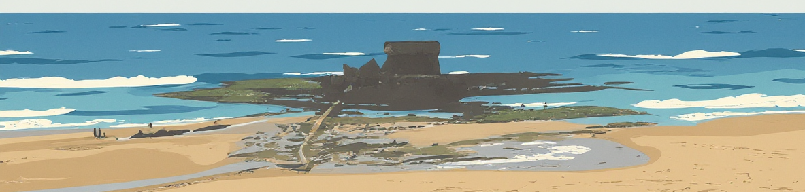

### Hi there 👋

🏭 I am currently working at [Cerema](https://www.cerema.fr/en) in the research team [UMR MCD](https://mcd.univ-gustave-eiffel.fr/).

🔬 My research activities focus on development of micromechanical models and numerical tools with applications to civil engineering materials.

[ GitHub](https://github.com/jfbarthelemy) 
[ ResearchGate](https://www.researchgate.net/profile/Jean-Francois_Barthelemy) 
[ Google Scholar](https://scholar.google.com/citations?user=RVjtCiAAAAAJ&hl=en) 
[ HAL](https://hal.archives-ouvertes.fr/search/index/?q=%2A&authIdHal_s=jfbarthelemy) 
[ Web Of Science](https://www.webofscience.com/wos/author/record/449919) 
[ ORCID](https://orcid.org/0000-0002-1968-8939) 
[ LinkedIn](https://www.linkedin.com/in/jean-fran%C3%A7ois-barth%C3%A9l%C3%A9my-75b3122/)

